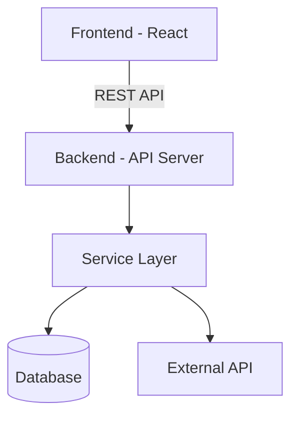
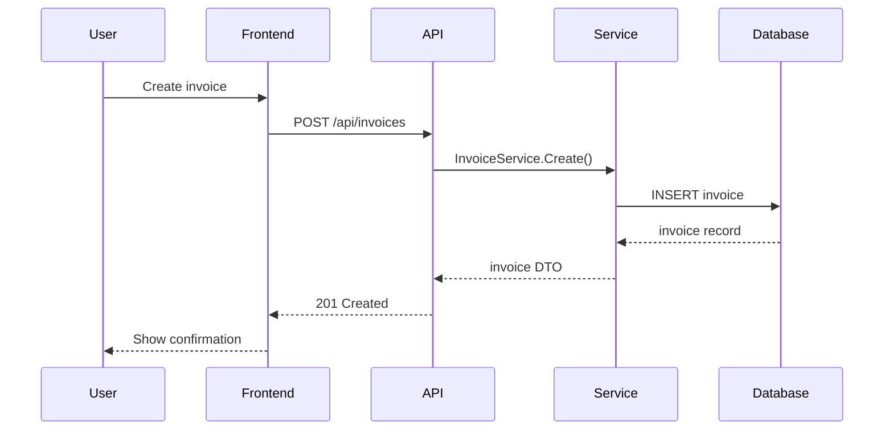
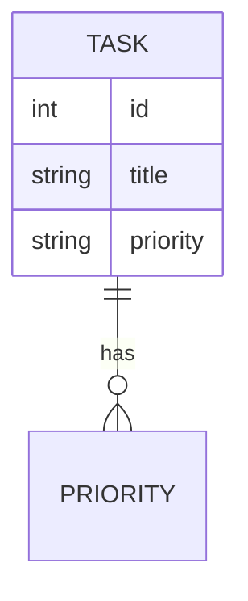

# Design Solution

Create a technical design document that defines **how** to build a feature. Bridges the gap between the PRD (what/why) and tasks (implementation steps).

---

## The Job

1. Read the approved PRD from `.features/{feature}/prd.md`
2. Research the existing codebase thoroughly
3. Generate a technical design document
4. Save to `.features/{feature}/design.md`
5. Call `open_file` for the design you just created (`mode: "view"`)
6. Present to user for approval

**Important:** Do NOT create tasks or implement. Just create the design.

---

## Step 1: Research the Codebase

Before writing anything, **understand what already exists**. This is the most critical step.

### Sub-agent assisted research

Use sub-agents to accelerate and deepen the research phase:

**Scout** — Fast codebase recon (cheap, uses Haiku). Start here to map the landscape:

```
subagent({ agent: "scout", task: "Find all code relevant to: {feature}. Focus on reusable components, hooks, services, data models, and established patterns." })
```

**Librarian** — Deep library research. Use when the feature integrates with external libraries:

```
subagent({ agent: "librarian", task: "Investigate how {library/framework} handles {specific concern}. Show the source code for key APIs we'll integrate with." })
```

**Oracle** — Architecture validation. After drafting the approach, ask the oracle to stress-test it:

```
subagent({ agent: "oracle", task: "Review this technical approach for {feature}: {brief description of approach}. Analyze trade-offs, identify edge cases, and suggest alternatives if there's a better way. Key files: {list relevant files}" })
```

**When to use which:**
- **Always** use scout first — it's fast and cheap
- Use librarian when integrating with libraries you don't fully understand
- Use oracle when facing non-trivial architecture decisions or trade-offs
- For simple features, scout alone may be sufficient

### What to search for:

- **Reusable components:** Search for UI components that can be reused or extended
- **Existing hooks:** Find custom hooks that already solve similar problems
- **API clients/services:** Identify existing API integration patterns
- **Backend services/handlers:** Find established patterns in the domain layer
- **Data models:** Understand current schema and relationships
- **Utilities:** Look for helper functions, validators, formatters already in use
- **Patterns:** How does the codebase handle similar features today?

### How to search (in addition to sub-agents):

```bash
# Find components
find . -name "*.tsx" -path "*/components/*" | head -30

# Find hooks
grep -rl "export function use" --include="*.ts" --include="*.tsx" | head -20

# Find API routes/handlers
find . -name "*.go" -path "*/handlers/*" | head -20

# Find services
find . -name "*.go" -path "*/services/*" | head -20

# Search for similar patterns
grep -rl "keyword" --include="*.ts" --include="*.tsx" --include="*.go" | head -20

# Check git log for prior art
git log --oneline --all --grep="related feature" | head -10
```

### Document what you find:

For every reusable piece, note:
- **File path**
- **What it does**
- **How it applies** to this feature
- **Whether it needs extension** or can be used as-is

---

## Step 2: Identify Improvements

While researching, look for opportunities to improve the architecture. Flag these explicitly:

- **Code duplication** that this feature could eliminate
- **Missing abstractions** that would benefit this and future features
- **Inconsistent patterns** that should be unified
- **Performance issues** in related code paths
- **Technical debt** that intersects with this feature's scope

**Rule:** Improvements must be justified. Don't refactor for the sake of refactoring. Every suggested change must make the code more maintainable, readable, or performant.

---

## Step 3: Design Document Structure

Generate the design with these sections:

### 1. Overview

Brief summary of the technical approach. 2-3 sentences explaining the high-level strategy.

### 2. High-Level Architecture

Provide Mermaid diagrams that visually explain the architecture. Include:

- **System/component diagram:** How the main pieces connect (frontend, backend, services, database, external APIs)
- **Data flow diagram:** How data moves through the system for the core use case(s)
- **Additional diagrams as needed:** Sequence diagrams for complex flows, ER diagrams for data models, state diagrams for stateful features

````markdown
#### System Architecture



#### Core Data Flow


````

**Guidelines:**
- Use Mermaid syntax (`graph`, `sequenceDiagram`, `erDiagram`, `stateDiagram-v2`)
- Keep diagrams focused — one concept per diagram, not everything in one
- Diagrams should be understandable without reading the rest of the document
- Reference the diagrams in subsequent sections (e.g., "As shown in the System Architecture diagram above...")

### 3. Codebase Analysis (What Already Exists)

What already exists that this feature will leverage:

```markdown
### Reusable Components
| Component | Path | Usage in this feature |
|-----------|------|-----------------------|
| DataTable | frontend/components/ui/data-table.tsx | Display invoice list |
| Modal | frontend/components/ui/modal.tsx | Confirmation dialogs |

### Existing Hooks
| Hook | Path | Usage in this feature |
|------|------|-----------------------|
| useApi | frontend/hooks/use-api.ts | API calls for CRUD |

### Backend Services
| Service | Path | Usage in this feature |
|---------|------|-----------------------|
| NotificationService | backend/notifications/service.go | Send email on status change |

### Existing Patterns to Follow
- [Pattern name]: [Where it's used] → [How we'll follow it]
```

### 4. Data Model

Schema changes, new entities, relationships:

```markdown
#### New Entities
- Entity name, fields, types, constraints

#### Modified Entities
- What changes and why

#### Relationships
- How new entities connect to existing ones
```

Include migration considerations if applicable. If the data model is non-trivial, include an ER diagram:

````markdown

````

### 5. API Design

New or modified endpoints/contracts:

```markdown
#### New Endpoints
| Method | Path | Request | Response | Purpose |
|--------|------|---------|----------|---------|

#### Modified Endpoints
| Endpoint | Change | Reason |
|----------|--------|--------|
```

### 6. Component Architecture (Frontend)

Structure, state management, data flow:

```markdown
#### New Components
| Component | Responsibility | Reuses |
|-----------|---------------|--------|

#### State Management
- What state is needed, where it lives, how it flows

#### Data Fetching
- Which hooks/patterns to use for data loading
```

### 7. Backend Architecture

Service layer, handler organization, business logic flow:

```markdown
#### Handler → Service → Repository flow
- How the request flows through layers
- Which existing services to extend vs. create new

#### Business Logic
- Key rules and where they're enforced
```

### 8. Integration Points

How this feature connects to existing systems:

- Which existing modules are touched
- Cross-cutting concerns (auth, validation, logging, notifications)
- External service interactions

### 9. Implementation Plan per User Story

Map each user story from the PRD to the architecture defined above. For each story, describe **how** the architecture solves it — which files change, which components/services are involved, and what the implementation approach is. This is not code, but a clear guide so each task is unambiguous.

```markdown
#### US-001: [Title from PRD]

**What changes:**
- `backend/migrations/001_add_priority.sql` — Add priority column to tasks table
- `backend/models/task.go` — Add Priority field to Task struct

**How it works:**
- Create a new migration that adds a `priority` column with type VARCHAR and default 'medium'
- Update the Task model to include the new field with proper validation
- References: System Architecture diagram (Database layer)

#### US-002: [Title from PRD]

**What changes:**
- `frontend/components/TaskCard.tsx` — Add PriorityBadge child component
- `frontend/components/ui/PriorityBadge.tsx` — New component (reuses Badge from design system)

**How it works:**
- Create PriorityBadge component that maps priority values to colors (red/yellow/gray)
- Render PriorityBadge inside TaskCard, positioned next to the title
- References: Core Data Flow diagram (Frontend → API response includes priority)
```

**Guidelines:**
- Cover **every** user story from the PRD — no story should be left unmapped
- Reference the architecture diagrams and components defined in earlier sections
- Focus on **what files change** and **the approach**, not implementation details
- Each story's implementation should be completable in one focused session
- If a story requires multiple non-trivial steps, note that it may need to be split into sub-tasks

### 10. Suggested Improvements

Opportunities identified during research:

```markdown
| Area | Current State | Suggested Improvement | Impact | Priority |
|------|--------------|----------------------|--------|----------|
```

**Only include improvements that are:**
- Directly related to or adjacent to this feature
- Clearly beneficial (not opinion-based)
- Implementable within the feature's scope or as a small follow-up

### 11. Trade-offs & Alternatives

What was considered and why this approach was chosen:

```markdown
#### Decision: [Decision title]
- **Chosen approach:** [What we're doing]
- **Alternative considered:** [What we rejected]
- **Why:** [Reasoning]
```

### 12. Open Questions

Unresolved technical decisions that need input:

```markdown
- [ ] Question 1 — [context and options]
- [ ] Question 2 — [context and options]
```

---

## Design Principles

The design must embody these principles:

1. **Reuse over reinvention** — Use existing components, hooks, services, and patterns. Only create new abstractions when nothing suitable exists.
2. **Follow established architecture** — Match the patterns already in the codebase. Consistency > personal preference.
3. **Clean code** — Clear naming, single responsibility, minimal coupling, explicit over implicit.
4. **Highlight improvements** — If you spot something that could be better, say so. But justify it.
5. **Design for the next developer** — The design should be readable by someone unfamiliar with the feature.

---

## Output

- **Format:** Markdown (`.md`)
- **Location:** `.features/{feature}/design.md`
- **After saving:** Call `open_file({ path: ".features/{feature}/design.md", mode: "view" })`

---

## Checklist

Before saving the design:

- [ ] Read the PRD thoroughly
- [ ] High-level architecture includes Mermaid diagrams (system, data flow, and others as needed)
- [ ] Searched codebase for reusable components, hooks, services, and patterns
- [ ] Documented all reusable pieces with file paths
- [ ] Data model changes are explicit (new entities, modified entities, relationships)
- [ ] API contracts are defined (method, path, request, response)
- [ ] Frontend architecture identifies which components to reuse vs. create
- [ ] Backend architecture follows existing handler → service → repository pattern
- [ ] Integration points with existing code are mapped
- [ ] Implementation plan covers every user story from the PRD with files and approach
- [ ] Improvements are justified and scoped
- [ ] Trade-offs document what was considered and why
- [ ] Open questions are listed for human review
- [ ] Saved to `.features/{feature}/design.md`
- [ ] Opened `.features/{feature}/design.md` with `open_file` in `view` mode

---

## Next Step

After design is reviewed and approved, create tasks:

> Say **"create tasks"** (or **"pro"**) to break the design into implementable tasks using the simple-tasks skill.
> Tasks will be saved to `.features/{feature}/tasks/`.
> Then say **"run the loop"** to start autonomous execution.
